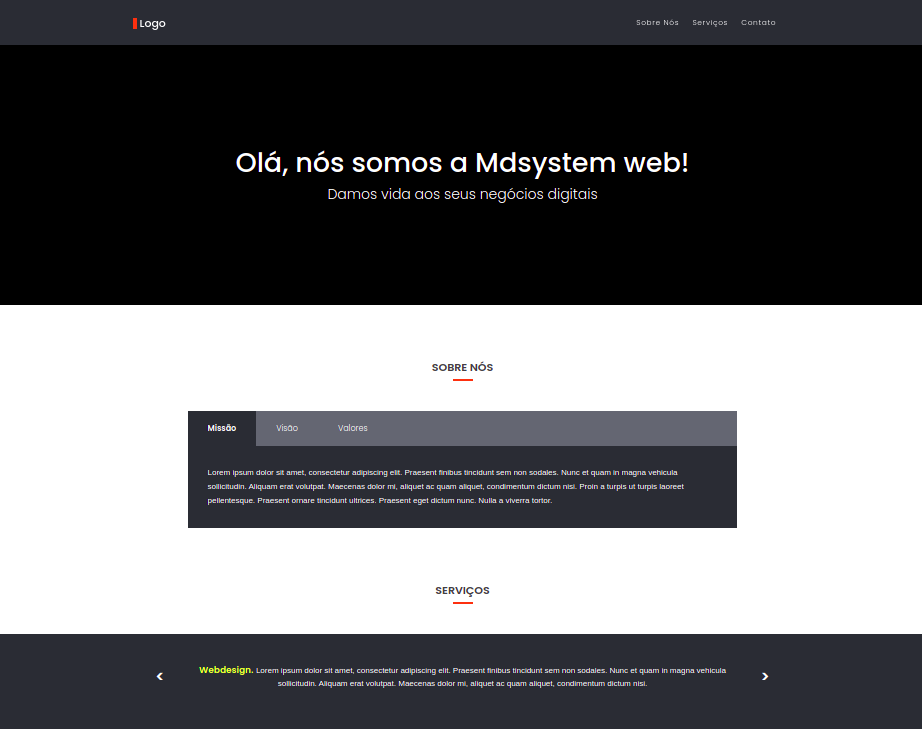

# Quer ser desenvolvedor frontend na MDsystem Web?
Criamos este teste para avaliar seus conhecimentos e habilidades frontend (HTML, CSS e JavaScript).

## O teste
O desafio é tornar o layout abaixo em uma página funcional. 
Não existe certo ou errado, queremos ver como você se sai em situações reais, como este desafio.
O tempo necessário para completar o desafio é de 3 dias após o envio do e-mail.

Portanto, dê o seu melhor!

:warning: **OBS:** Os layouts podem ser encontrados na pasta **layout**



## Instruções
- O conteúdo não é estático. Você deve criar um JavaScript para consultar as informações de sobre nós e serviços.
- URL API
    - API Serviços: https://www.mdsystemweb.com.br/projects/api/v1/test/services.php
    - API About: https://www.mdsystemweb.com.br/projects/api/v1/test/about.php
- Fonte padrão: "Poppins".
- No JavaScript usar (JavaScript, jQuery, ou react.js).
- No CSS usar (Flex box).
- Crie uma documentação simples comentando sobre as tecnologias e soluções adotadas.
- Se necessário explique também como rodar o seu projeto.
- Realize o desenvolvimento dentro da pasta public

## Requisitos
- Design responsivo nos breakpoints 320px, 768px, 1024px e 1440px
- Suporte para IE, Chrome, Safari, Firefox

## Diferenciais
- Uso de pré-processadores CSS (Sass, Less)
- Utilizar alguma automatização (Grunt, Gulp, ...)

## O que será avaliado
- Estrutura e organização do código e dos arquivos
- Soluções adotadas
- Tecnologias utilizadas
- Qualidade
- Fidelidade ao layout
- Enfim, tudo será observado e levado em conta

## Como iniciar o desenvolvimento
- Instale o [npm](https://nodejs.org/en/download/)
- Fork este repositório na sua conta do Bitbucket
- Crie uma branch com o nome **desafio**
- Instale as dependências
```
npm install
```
- Rode a aplicação
```
npm start
```
- Acesse http://localhost:8888

## Como enviar seu teste
- Envie um email para [diogo.alves@mdsystemweb.com.br] com o link do seu repositório
- Se o seu repositório for privado, solicite os emails das pessoas responsáveis para conceder acesso de leitura ao seu repositório.
